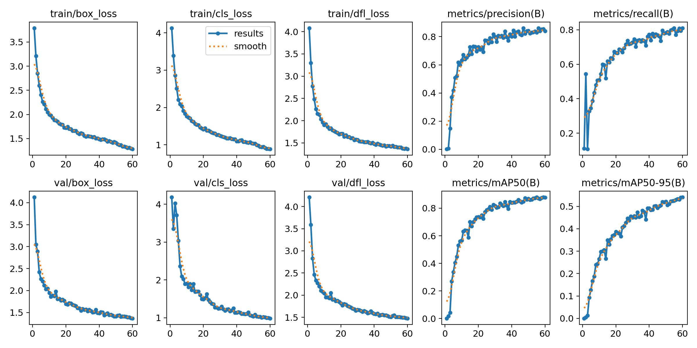

# Pothole Severity Detection using YOLO

This repository contains implementations of **YOLOv12** and a **YOLOv5 baseline** for detecting potholes and classifying their severity (Low, Medium, High) from images.

---

## Table of Contents
1. [Usage](#usage)
2. [Project Overview](#project-overview)
3. [Dataset](#dataset)
4. [Models](#models)
5. [Training & Evaluation](#training--evaluation)
6. [Results](#results) 
---


## 1. Usage
1. Clone this repository:
2. Install libraries
```bash
pip install -r requirements.txt
```
3. Start the application
```bash
python app.py
```

## 2. Project Overview
This project aims to detect potholes on roads and classify their severity using state-of-the-art YOLO object detection models.  
We compare **YOLOv12** against a **YOLOv5 baseline** to demonstrate improvements in detection accuracy and robustness.

---

## 3. Dataset
- Custom [dataset](https://universe.roboflow.com/aegis/pothole-detection-i00zy/dataset/2) of pothole images
- Images are split into **training (70%)**, **validation (20%)**, and **test (10%)** sets.

---

## 4. Models
- **YOLOv5 (baseline)**: medium variant (`yolov5s`) trained on the custom pothole dataset.
- **YOLOv12**: medium variant (`yolov12s`) trained on the same dataset.

Both models were trained without major modifications to compare baseline performance with YOLOv12.

---

## 5. Training & Evaluation
- Training performed on **Google Colab** with GPU acceleration.
- Models trained for 60 epochs with standard YOLO hyperparameters.

- Metrics computed on the **test set**:
  - **Precision**  
  - **Recall**  
  - **F1-score**  
  - **mAP@50**  
  - **mAP@50:95**  
  - **mAP@75**

---

## 6. Results

| Model     | mAP 50:95 | mAP 50 | mAP 75 | Precision (%) | Recall (%) | F1-score (%) |
|-----------|------------|--------|--------|---------------|------------|--------------|
| YOLOv5 (Baseline)    | 40.81      | 70.04  | 45.13  | 71.82         | 82.10      | 76.62        |
| YOLOv12   | 52.38      | 84.18  | 59.37  | 87.75         | 78.28      | 82.74        |


**Observations:**
- YOLOv12 outperforms YOLOv5 across most metrics.  
- mAP improvement indicates better bounding box localization.  
- Precision is higher in YOLOv12, while recall is slightly lower than YOLOv5.  
- Overall F1-score improves, showing balanced detection performance.

---
