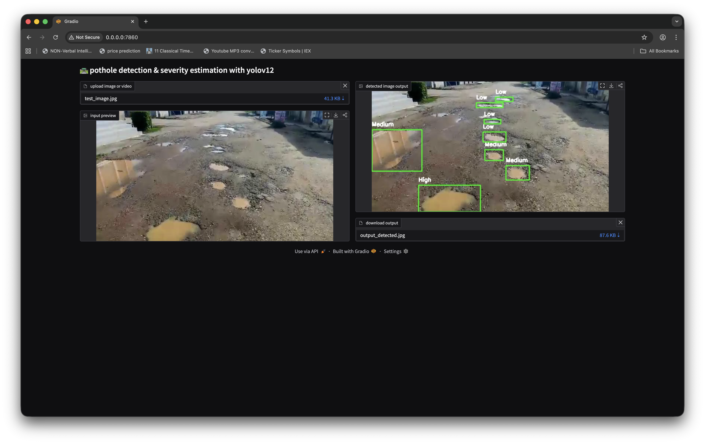

# Pothole Detection & Severity Estimation System

This repository contains implementations of **YOLOv12** and a **YOLOv5 baseline** for detecting potholes and classifying their severity from images. This project implements a real-time computer vision system for automated detection and severity classification of road potholes, leveraging the YOLOv12s deep learning architecture for high-speed object localization. The core innovation is a lightweight Hybrid Severity Scoring mechanism that classifies potholes into Low, Medium, or High risk tiers by analyzing 2D bounding box attributes specifically, the pothole's relative area and its vertical position in the image (as a proxy for distance/proximity). This system is designed for cost-effective deployment in infrastructure monitoring applications, and its final inference pipeline is fully accessible and demonstrable through an interactive Gradio web interface that handles both image and video streams.

## NOTE:
Notebooks are used for fine-tuning purpose, after model fine-tuning dataset, training results and .pt files get zipped into YOLOv5.zip and YOLOv12.zip files respectively.

## 1. Usage
1. Clone this repository
2. Install libraries
```bash
pip install -r requirements.txt
```
3. Start the application
```bash
python app.py
```

## 2. Project Overview
This project aims to detect potholes on roads and classify their severity using state-of-the-art YOLO object detection models. We compare **YOLOv12** against a **YOLOv5 baseline** to demonstrate improvements in detection accuracy, robustness and speed.

---

## 3. Dataset
- Custom [dataset](https://universe.roboflow.com/aegis/pothole-detection-i00zy/dataset/2) of pothole images
- Images are split into **training (70%)**, **validation (20%)** and **test (10%)** sets.

---

## 4. Models
- **YOLOv5 (baseline)**: medium variant (`yolov5s`) fine-tuned on the custom pothole dataset.
- **YOLOv12**: medium variant (`yolov12s`) fine-tuned on the same dataset.

Both models were fine-tuned without any modifications to compare baseline performance with YOLOv12.

---

## 5. Fine-tuning & Evaluation
- Fine-tuning was performed on **Google Colab NVIDIA T4** accelerator.
- Models trained for 60 epochs with standard YOLO hyperparameters.


---

## 6. Results
Below metrics are computed on the **test set**

| Model     | mAP 50:95 | mAP 50 | mAP 75 | Precision (%) | Recall (%) | F1-score (%) |
|-----------|------------|--------|--------|---------------|------------|--------------|
| YOLOv5 (Baseline)    | 40.81      | 70.04  | 45.13  | 71.82         | 82.10      | 76.62        |
| YOLOv12   | 52.38      | 84.18  | 59.37  | 87.75         | 78.28      | 82.74        |

⚡ Inference Speed Comparison (NVIDIA T4 GPU)

| Model | Layers | Latency (L) | Speed (FPS) |
|:---|:---|:---|:---|
| YOLOv5s (Baseline) | 157 | 11.55 ms | ~86.6 |
| YOLOv12s | 376 | 3.14 ms | ~318.5 |

**Observations:**
- YOLOv12 outperforms YOLOv5 across most metrics.  
- mAP improvement indicates better bounding box localization.  
- Precision is higher in YOLOv12, while recall is slightly lower than YOLOv5.  
- Overall F1-score improves, showing balanced detection performance.
- Inference speed is higher in YOLOv12.

---
